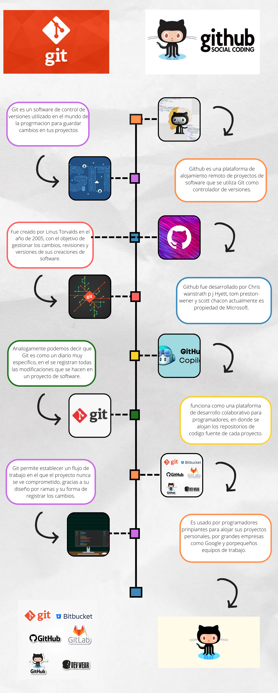

<!-- No borrar o modificar -->
[Inicio](./index.md)

## Sesión 1 
Objetivo: Aprender los conceptos básicos de Python, Git y GitHub y crear una infografía para cada tema que explique de manera clara y visual.

Instrucciones:

Investiga sobre Python, Git y GitHub por separado. Busca información sobre qué son, para qué se utilizan y cuáles son sus principales características.

Selecciona la información más relevante y útil para crear una infografía para cada tema que explique de manera clara y visual los conceptos básicos de Python, Git y GitHub.

Utiliza herramientas de diseño gráfico para crear las infografías.

Asegúrate de que cada infografía sea fácil de entender y visualmente atractiva. Utiliza colores llamativos, íconos e imágenes para hacerlas más atractivas.

Python
Python es un lenguaje de programación de código abierto, creado por Guido van Rossum en 1991. Se trata de un lenguaje orientado a objetos, fácil de interpretar y con una sintaxis que permite leerlo de manera semejante a como se lee el inglés. Es un lenguaje interpretado, esto significa que el código de programación se convierte en bytecode y luego se ejecuta por el intérprete, que, en este caso, es la máquina virtual de Python.
Con el paso de los años, Python ha crecido en popularidad y funciones, lo que ha contribuido a la flexibilidad de uso. Hacer y probar cambios rápidamente al código es una tarea sencilla.
Python también es fácil de aprender. Estos dos factores han contribuido a que sea el lenguaje preferido de los principiantes que incursionan en el desarrollo de software. Su versatilidad como lenguaje de programación para propósitos generales lo hace adecuado para las necesidades de muchas industrias.

Para qué sirve Python
La respuesta es breve: para todo. Python está en todo, desde programación de instrumentos hasta software de computadoras, desarrollo web y aplicaciones móviles. Incluso, te permite hacer comentarios para que tengas recordatorios para funciones futuras o indicar problemas en una línea de código. 
Python es genial para casi cualquier necesidad de desarrollo, ya sea programación de servidores, operación de sistemas, software, juegos y mucho más.

Por qué usar Python

Python se creó para que la programación fuera un proceso más fluido para los desarrolladores. Como resultado, el lenguaje es fácil de aprender. Al estar vigente por más de dos decenios, es una gran entrada para aprender otros lenguajes.
Si no tienes experiencia en programación, existen recursos que hablan sobre cómo comenzar a hacer código. Sin embargo, hay algunas cosas que debes considerar al estudiar cualquier lenguaje nuevo y Python no es la excepción.
Este lenguaje se discute en muchas plataformas, empezando con Python Español y Comunidad Python. Por supuesto, estos no son los únicos lugares donde puedes encontrar ayuda, pero son dos de los recursos más poderosos que conviene que tengas al alcance. Siempre puedes buscar otros foros y sitios web para localizar respuestas, consejos, trucos y continuar tu educación sobre Python.

Empresas que utilizan Python
Hay muchas empresas que utilizan este lenguaje para sus proyectos tales como
Google, Instagram, la nasa, Pinterest, panda 3D, Dropbox, Spotify, Netflix, Uber, Reddit, Youtube.

Principales usos con Python.
Desarrollo web. Python es conocido como el lenguaje referente para el desarrollo. Python incluye múltiples marcos web como Pyramid, Django y Flask, que están repletos de bibliotecas que permiten una sencilla integración de protocolos y minimizan el tiempo de desarrollo.
Ciencia de datos. La ciencia de datos es una de las competencias más demandadas en el mercado. Aquí entra en escena Python. Las múltiples bibliotecas con las que cuenta, ayudan a extraer información valiosa de los datos y visualizarlos mediante gráficos y tablas. Python es una de las primeras cosas que cualquier profesional de ciencia de datos debería saber.
Inteligencia artificial y aprendizaje automático. Uno de los usos de Python más fundamentales es la Inteligencia Artificial. Esto es debido a que Python es un lenguaje estable con una capacidad para manejar los cálculos imprescindibles para crear modelos de aprendizaje automático. Además, este lenguaje de programación utiliza diversas soluciones de Inteligencia Artificial, como la informática avanzada, el procesamiento de datos, entre otras.
Aplicaciones empresariales. Las apps empresariales se usan para solventar las necesidades de una empresa más que para usuarios particulares. El uso de este lenguaje de programación en el desarrollo de aplicaciones para empresas se lleva a cabo porque se trata de un lenguaje fuerte que puede controlar diversas solicitudes de bases de datos al mismo tiempo. A pesar de que Python cambia de una empresa a otra, sus funcionalidades principales como la funcionalidad y la legibilidad permanecen iguales.
Sector educativo. Otro de los usos que puedes hacer en Python es el desarrollo de cursos y programas educativos online. Se trata de un lenguaje de programación sencillo de entender para principiantes porque su sintaxis es igual a la del inglés. Esta es una de las principales razones por las que Python se ha convertido en el lenguaje de programación usado por los desarrolladores de programas educativos tanto en niveles más básicos como avanzados. 
Aplicaciones de web scraping. Esto se refiere al raspado de grandes cantidades de datos por parte de las organizaciones para extraer datos de los clientes y tomar decisiones rentables. Con sus herramientas como PythonRequest, se utiliza este lenguaje para crear aplicaciones web scraping. Python tiene una gran capacidad
¿Qué es Git?
Git es un Sistema de Control de Versiones Distribuido (DVCS) utilizado para guardar diferentes versiones de un archivo (o conjunto de archivos) para que cualquier versión sea recuperable cuando lo desee.
Git también facilita el registro y comparación de diferentes versiones de un archivo. Esto significa que los detalles sobre qué cambió, quién cambió qué, o quién ha iniciado una propuesta, se pueden revisar en cualquier momento.
¿Pero si Git es un Sistema de Control de Versiones Distribuido, qué significan exactamente esos términos?

¿Qué significa "distribuido"?

El término "distribuido" significa que cuando le instruyes a Git que comparta el directorio de un proyecto, Git no sólo comparte la última versión del archivo. En cambio, distribuye cada versión que ha registrado para ese proyecto.
Este sistema "distribuido" tiene un marcado contraste con otros sistemas de control de versiones. Ellos sólo comparten cualquier versión individual que un usuario haya explícitamente extraído desde la base de datos central/local.
Bueno, entonces "distribuido" significa distribuir todas – no solo algunas seleccionadas – versiones de los archivos del proyecto que Git haya registrado. ¿Pero qué es exactamente un sistema de control de versiones?

¿Qué es un Sistema de Control de Versiones?
Un Sistema de Control de Versiones (VCS) se refiere al método utilizado para guardar las versiones de un archivo para referencia futura.
De manera intuitiva muchas personas ya utilizan control de versiones en sus proyectos al renombrar las distintas versiones de un mismo archivo de varias formas como blogScript.js, blogScript_v2.js, blogScript_v3.js, blogScript_final.js, blogScript_definite_final.js, etcétera. Pero esta forma de abordarlo es propensa a errores y inefectivo para proyectos grupales.
Además, con esta forma de abordarlo, rastrear qué cambió, quién lo cambió y porqué se cambió, es un esfuerzo tedioso. Esto resalta la importancia de un sistema de control de versiones confiable y colaborativo como Git.
Sin embargo, para obtener lo mejor de Git, es importante entender cómo Git administra tus archivos.

¿Qué es Github?
A grandes rasgos Github es un proveedor de hospedaje (hosting en inglés) en internet para desarrollo de software y control de versiones usando Git. Ofrece control de versiones distribuido y manejo de codigo fuente, ambas funciones de Git, además otras características para facilitar el ciclo de desarrollo de software. Brinda control de acceso, características de colaboración como seguimiento de errores, solicitudes de incorporación de características, administración de tareas o proyectos como Trello, integración continua y despliegue continuo (CI/CD por sus siglas en inglés). Actualmente es una empresa subsidiaria de Microsoft desde el 2018.
Siendo el repositorio de código por excelencia para proyecto de Software Libre, actualmente Github posee más de 56 millones de desarrolladores, más de 3 millones de organizaciones, y más de 100 millones de repositorios de código.
Características
El principal propósito de Github es facilitar el ciclo de desarrollo de software. Github brinda las siguientes características:
Etiquetas, hitos, asignación de responsabilidades y un motor de búsqueda para el seguimiento de errores.
Solicitudes de incorporación de cambios (Pull request): consiste en la acción de validar un código que se va a fusionar de una rama a otra. En este proceso de validación pueden entrar los factores que queramos: validaciones automáticas de integración, asignación de código a tareas, validaciones manuales por parte del equipo, despliegues, etc. Brindando la posibilidad de ver de forma muy sencilla las diferencias del código, y comentarlas, aprobarlas, proponer cambios, etc.
Documentación, incluyendo el renderizado automatico de los archivos README empleando Markdown.
GitHub Actions: se usan para construir flujos de integración y despliegue continuo para pruebas o despliegues, todo de forma automática.
Gráficas: gráficas con información como los contribuidores, frecuencia de código, miembros, commits, y más.
Notificaciones vía email: notificaciones via email configurables ante determinados eventos.
Discusiones
Soporte para emojis
Alertas de seguridad para Vulnerabilidades o Exposiciones Comunes en nuestro codigo o en sus dependencias
Las anteriores son algunas de las características más conocidas de Github.

<!-- Su documentación aquí -->

